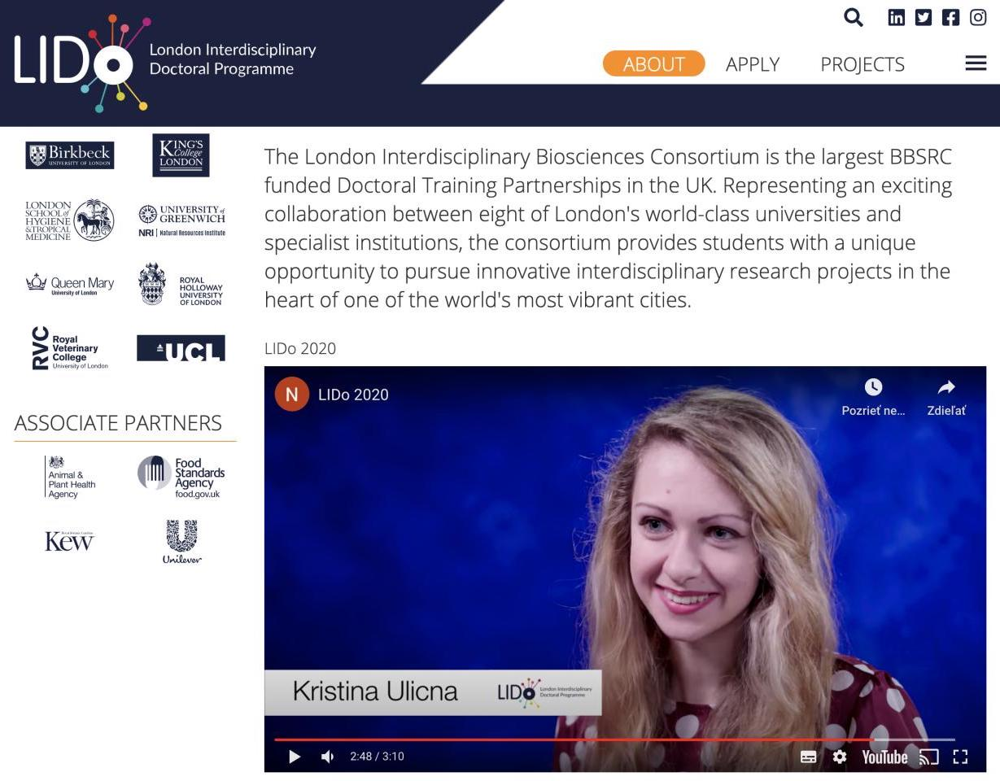
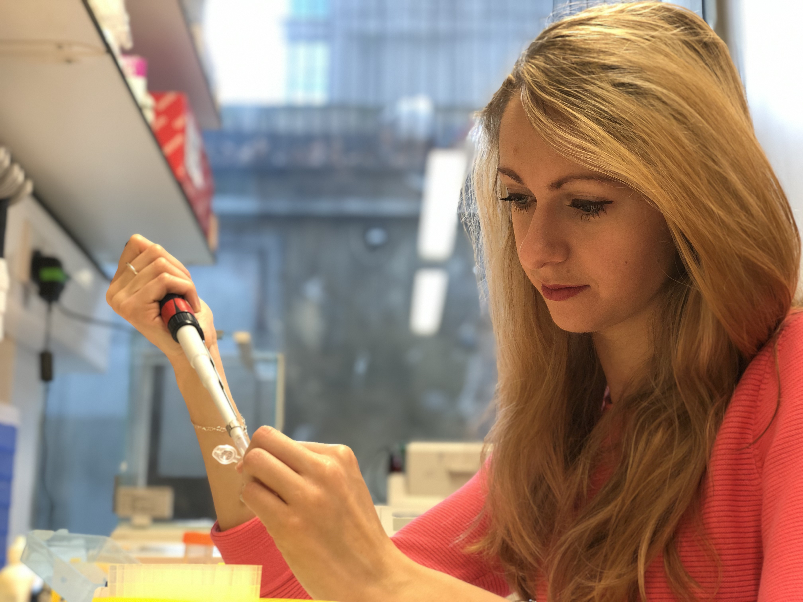
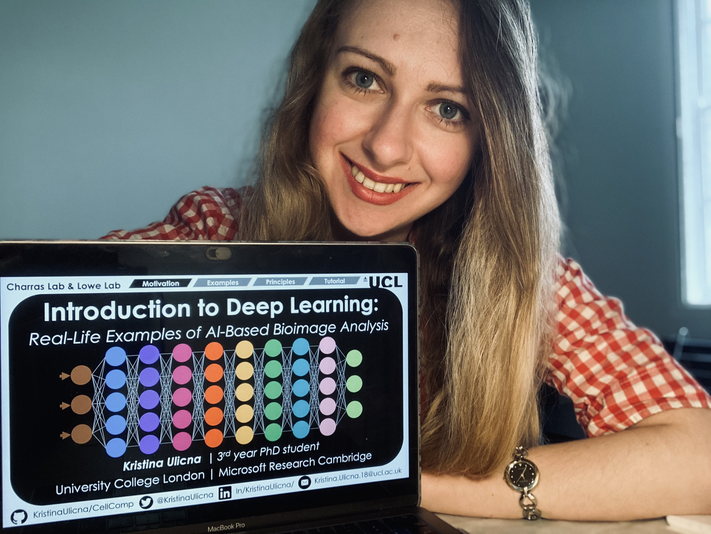
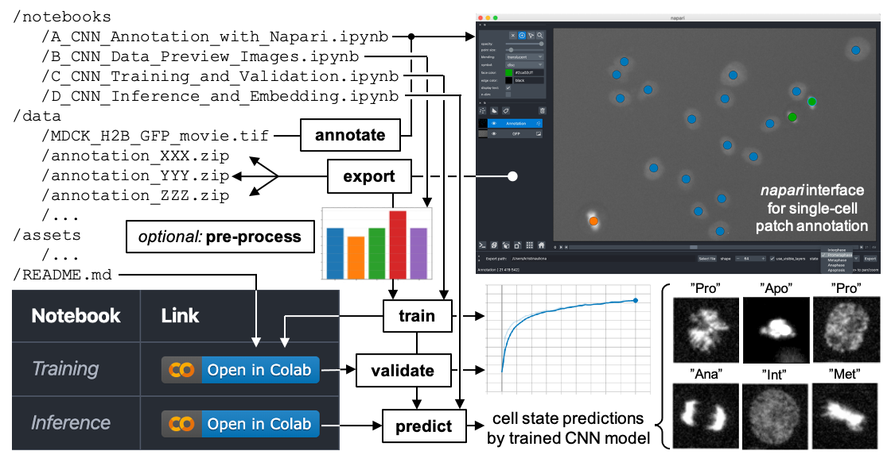

<!-- Your title -->

# Welcome to Kristina's GitHub Page! 👋

💡 Let's get straight to the point: [Check out my CV](CV_Kristina_Ulicna.pdf "Kristina's CV") 📄

My name is **_Kristina Ulicna_** & I'm a final (4<sup>th</sup>) year **_PhD candidate_** at University College London 🎓 within the [London Interdisciplinary Doctoral (LIDo) Bioscience Programme](https://www.lido-dtp.ac.uk/about-us "LIDo Doctoral Programme"), the largest BBSRC-funded Doctoral Training Partnership in the UK 🇬🇧. I'm a **_computational biologist_** focussing on the interplay between single cell cycling duration prediction & **_AI-driven bioimage analysis_** tool development.

<!-- Your badges
You can use the website to generate badges: https://shields.io/
-->

[](https://github.com/KristinaUlicna)
[](https://www.linkedin.com/in/kristinaulicna/)
[](https://twitter.com/KristinaUlicna)
[](mailto:kristina.smith.ulicna@gmail.com)
[](mailto:kristina.ulicna.18@ucl.ac.uk)
[](https://www.researchgate.net/profile/Kristina_Ulicna2)
[](https://scholar.google.com/citations?view_op=list_works&hl=en&user=3YKbZ6cAAAAJ)


<!-- Talking about you -->

## Me, a Computational Biologist

<!-- Any image aligned to the right. Beware the width -->
<!--img width="50%" align="right" alt="LIDo_Int" src="https://github.com/KristinaUlicna/KristinaUlicna/blob/master/LIDo_Interview.jpg" /-->




I'm a trained biomedical scientist turned computational biologist. After obtaining my BSc degree in Biomedical Science @ King's College London, I started my PhD training with the London Interdisciplinary Doctoral (LIDo) Programme @ University College London (UCL). I'm split between the [CellX group](http://lowe.cs.ucl.ac.uk/cellx.html "CellX group") teams lead by Drs Alan Lowe (The Alan Turing Institute 'AI for Science' Fellow, UCL) & Guillaume Charras (London Centre for Nanotechnology, UCL).

If you are a non-scientist interested in what I do, before you get overwhelmed by the scientific jargon & terminology, check out my recent [#DeepTree🌳 Tweetorial Thread 🧵](https://twitter.com/KristinaUlicna/status/1305479359084539904 "DeepTree Thread on Twitter") for an easy-to-digest breakdown of my research for lay audience! In case you're not scared of the technical terms, don't hesitate to check out my latest [Tweet with a Link 🔗](https://twitter.com/KristinaUlicna/status/1440731210175582212 "Frontiers Publication Link") to our recently published article in _Frontiers of Computer Science_ journal.

*Wanna jump straight to the papers?* Click on the following links to access our **"Automated deep lineage tree analysis using a Bayesian single cell tracking approach"** work on [Frontiers](https://www.frontiersin.org/articles/10.3389/fcomp.2021.734559/full "Frontiers publication") journal website, [bioRxiv](https://www.biorxiv.org/content/10.1101/2020.09.10.276980v1.full "bioRxiv preprint") preprint repository or scroll below to the [Citation section](#citations) find out how to properly cite our work!

---

## Me, a Research Scientist

<!-- Any image aligned to the right. Beware the width -->
<!--img width="30%" align="left" alt="bioRxiv" src="https://github.com/KristinaUlicna/KristinaUlicna/blob/master/bioRxiv_preprint.jpg" /-->

<!--img width="30%" align="left" alt="bioRxiv" src="./bioRxiv_preprint.jpg" /-->

#### Past Achievements

I'm a trained **cancer biologist** with a 1st class Biomedical Science degree from King's College London. I'm a practical & detail-oriented researcher with a unique combination of wet-lab & dry-lab skills which I gained through various [internship experience](CV_Kristina_Ulicna.pdf "Kristina's CV") in both **academia & industry**. To point out a few, I interned in the famous [Robert Weinberg's Lab](http://weinberglab.wi.mit.edu/ "Bob Weinberg Lab website") at **Massachusetts Institute of Technology (MIT)** in Cambridge, MA, USA where I worked on the identification of a novel tumour suppressor gene. Most recently, **Microsoft Research Cambridge** [Inner Eye group](https://www.microsoft.com/en-us/research/project/medical-image-analysis/ "Inner Eye Group Website") welcomed me to their team for 6-month PhD internship, which I spent contributing to the SOTA solutions of a (bio)medical image analysis-oriented Kaggle challenge in collaboration with the [Human Protein Atlas](https://www.kaggle.com/c/hpa-single-cell-image-classification/overview "Human Protein Atlas - Single Cell Classification") database founders.

<!-- Any image aligned to the right. Beware the width -->
#### Present Interests



As a final year PhD candidate, I'm interested in deep learning-based prediction of **single-cell cycling duration** in non-/cancer cell populations. I use time-lapse microscopy movies to enhance my passion for the _big data science, deep learning & computational cell tracking_ to understand morphological features influencing **single cell fate decisions**. I'm actively developing AI-driven tools to answer my PhD thesis project goal - predict cell cycle duration from cell's early life. To do so, I combine feature handcrafting tools with **variational autoencoders (VAE)** approaches to encode the single-cell lifetime to assemble single-cell data into sequences for single-cell trajectory reconstruction. I'm clustering these data to find (dis-)similarities between the individual cells. Using **time-sequence analysis** methods, I shortlist the regions of the sequence data to identify patterns leading to pre-determination of cell cycle lifetimes.


#### Future Outlooks

I'm currently in search for a **full-time Research Scientist positions** at the interface of Machine Learning & Biological / Biomedical Research after my upcoming graduation (expected end of 2022). If my work sparked some interest in you, do not hesitate to get in touch! Don't forget to check [my up-to-date CV](CV_Kristina_Ulicna.pdf "Kristina's CV") for a better overview of my skillset, work / teaching experience & professional interests, [my PhD thesis poster](https://github.com/KristinaUlicna/DeepTree/blob/master/DeepTree_Poster.pdf "DeepTree Project Poster") for summary of the key results of the 1st chapter of my thesis ( = development of software tools & computational pipelines applied to biological research), or write me an [email](mailto:kristina.smith.ulicna@gmail.com) / message me directly using the social media links panel above. Always happy to hear from you!

---

## Me, a Science Communicator

I love talking about my research to a variety of audiences! Whether you're an expert with 20 years worth of research experience or a lay listener fascinated by biomedical science, you're at the right place... Let me list a few resources you may be interested in having a look at to learn more about my research interests: use this **traffic light system** to navigate the links based on your level of expertise:



- 🟩 : lay audience with interest to learn more
- 🟧 : scientist / technologist from outside of this field
- 🟥 : expert 'singlecellologist' who enjoys the niche jargon 🤓)


1. 🟢🟩🟢 In this [Twitter thread 🧵](https://twitter.com/KristinaUlicna/status/1305479359084539904 "#DeepTree on Twitter"), I introduced the objective of my PhD research project & how we tackled the single-cell heterogeneity in cell populations by developing super-cool live-cell microscopy & computational tools... 🧪

2. 🟢🟩🟢 I spoke about my research at the [PyLadies Meetup 👩‍💻](https://www.youtube.com/watch?v=UIY-Z7daEG0&t=977s&ab_channel=DublinPyLadies "PyLadies Dublin November 2020") where I delivered a talk about how Python (the programming language, not the snake 🐍!) can serve as an incredibly useful tools to (not only computational) biologists... 💻

3. 🟠🟧🟠 This short 12-second [LinkedIn movie 🎬](https://www.linkedin.com/posts/kristinaulicna_cellcyclecontrol-microscopy-images-activity-6685890976306745344-gNFo "LinkedIn Heterogeneity Movie") illustrates how much information 📊 regarding cell cycle control one may squeeze out from a sequence of microscopy images using machine (deep) learning... 🔬

4. 🟠🟧🟠 This visually-appealing [Twitter thread 🧵](https://twitter.com/KristinaUlicna/status/1283043766987890688 "'Intro to Deep Learning' Masterclass") summarises the key outcomes 🔑 of the "Introduction to Deep Learning" MasterClass (with [Youtube link](https://youtu.be/Cg1WKM2eWxs "'Introduction to Deep Learning' MasterClass | Kristina Ulicna") to the talk) which I recently delivered at the UCL Cancer Domain Early Career Network... 👩‍🏫

5. 🔴🟥🔴 I describe the scientific details of *my PhD thesis research project* in my [CellComp repository](https://github.com/KristinaUlicna/CellComp "CellComp repository") where I explain the background, objectives, methodology & key results of my doctoral thesis project... 👩‍🔬

6. 🔴🟥🔴 And last but not least, our recent publications to be found at [Frontiers](https://www.frontiersin.org/articles/10.3389/fcomp.2021.734559/full "Frontiers publication") journal website or at the [bioRxiv](https://www.biorxiv.org/content/10.1101/2020.09.10.276980v1.full "bioRxiv preprint") preprint repository should give you all the details you need to know about what we've done in the lab & beyond. ➡️ We also encourage you to jump to my [DeepTree repository](https://github.com/KristinaUlicna/DeepTree "DeepTree repository") if you'd like to learn even more... 🌳
---

### What keeps me busy? 👩‍💻 Live projects 🚧

- 👨🏽‍💻 I’m working towards my [PhD thesis research project](https://github.com/KristinaUlicna/DeepTree "DeepTree Project Repository") for cell trajectory clustering;
- 🌱 I’m training some [Variational AutoEncoders (VAEs)](https://arxiv.org/pdf/1312.6114.pdf "Variational AutoEncoders") for single-cell image encoding;
- ⛓️ I'm analysing time-sequence data to find (dis-)similarities across cell cycle lives;
- 👯 I’m looking to collaborate on bioscience research ideas & projects involving AI;
- 💼 I'm in search of interesting technical roles & job openings to enhance my skills;
- 🤔 I’m thinking about single cells & their heritable patterns across generations;
- 💬 Ask me about anything -> [I am happy to answer your questions](mailto:kristina.smith.ulicna@gmail.com) & help you out;
- 📫 How to reach me: check the banners on top / bottom of this page!


### Languages & Tools 🔧

<!-- Your github readme stats
You can use this api: https://github.com/kristinaulicna/github-readme-stats
-->
<p>
  <a href="https://github-readme-stats.vercel.app/api?username=kristinaulicna&show_icons=true">
    
  </a>

  <!-- Your languages and tools. Be careful with the alignment.
  You can use this sites to get logos: https://www.vectorlogo.zone or https://simpleicons.org/
  -->
  <code></code>
  <code></code>
  <code></code>
</p>

### Open-Source Projects 🚧

I've been contributing to a handful of open-source projects lately, mastering my **software engineering skills** & how to improve my programming practices. Check out my contributions directly by viewing some of my pull requests:


| Library / Package | Description | Repository Traffic | Link to View Pull Request |
| --- | --- | --- | --- |
| `cellx` | Data pre-processing for AI model training | [](https://github.com/quantumjot/cellx) [](https://github.com/quantumjot/cellx) | [](https://github.com/quantumjot/cellx/pull/52) |
| `cellx-predict` | Explainable AI model of single-cell behaviour | [](https://github.com/quantumjot/cellx-predict) [](https://github.com/quantumjot/cellx-predict) | [](https://github.com/lowe-lab-ucl/cellx-predict/pull/33) |
| `cnn-annotator` | Microscopy images annotation for CNN classification | [](https://github.com/lowe-lab-ucl/cnn-annotator) [](https://github.com/lowe-lab-ucl/cnn-annotator) | [](https://github.com/lowe-lab-ucl/cnn-annotator/pull/35) |
| `arboretum` | Track and lineage visualization with `btrack` and `napari` | [](https://github.com/lowe-lab-ucl/arboretum) [](https://github.com/lowe-lab-ucl/arboretum) | [](https://github.com/lowe-lab-ucl/arboretum/pull/3) |
| `BayesianTracker` | Bayesian multi-object tracking for cell lineage reconstruction | [](https://github.com/quantumjot/BayesianTracker) [](https://github.com/quantumjot/BayesianTracker) | [](https://github.com/quantumjot/BayesianTracker/pull/61) |

_...and many others..._ just visit [my GitHub repositories link](https://github.com/KristinaUlicna?tab=repositories "Kristina's GitHub repositories") 🔗 for more details


### Getting in Touch 💬

If you're interested in more details about:
+ **My professional background & research experience,** have a look at [my CV](CV_Kristina_Ulicna.pdf "Kristina's CV") 📄 or choose to click on the links below 👇
+ **My scientific achievements & publications,** visit my [*DeepTree repository*](https://github.com/KristinaUlicna/DeepTree "DeepTree repository") to discover the beauty of our recent publication
+ **My PhD thesis & research interests,** click on my [*CellComp repository*](https://github.com/KristinaUlicna/CellComp "CellComp repository") where I explain the aims, methodology & key results of my doctoral thesis project

[](https://github.com/KristinaUlicna)
[](https://www.linkedin.com/in/kristinaulicna/)
[](https://twitter.com/KristinaUlicna)
[](mailto:kristina.smith.ulicna@gmail.com)
[](mailto:kristina.ulicna.18@ucl.ac.uk)
[](https://www.researchgate.net/profile/Kristina_Ulicna2)
[](https://scholar.google.com/citations?view_op=list_works&hl=en&user=3YKbZ6cAAAAJ)

---
### Citations



More details about my recent publications focussed on single-cell tracking approach from time-lapse microscopy data can be found in my [*DeepTree repository*](https://github.com/KristinaUlicna/DeepTree "DeepTree repository") or in the following publications:

**Convolutional neural networks for classifying chromatin morphology in live cell imaging**  
Ulicna K, Ho LTL, Soelistyo CJ, Day NJ & Lowe AR  
*Methods in Molecular Biology, Springer Nature Protocols* (2022)  
<https://github.com/lowe-lab-ucl/cnn-annotator>  
_(accepted; in press)_

**Automated deep lineage tree analysis using a Bayesian single cell tracking approach**  
Ulicna K, Vallardi G, Charras G and Lowe AR  
*Frontiers in Computer Science, Computer Vision: Methods & Tools for Bioimage Analysis* (2021)  
<https://www.frontiersin.org/articles/10.3389/fcomp.2021.734559/full>  
<https://www.biorxiv.org/content/10.1101/2020.09.10.276980v1.full>

```
@ARTICLE{10.3389/fcomp.2021.734559,
  AUTHOR = {Ulicna, Kristina and Vallardi, Giulia and Charras, Guillaume and Lowe, Alan R.},   
  TITLE = {Automated Deep Lineage Tree Analysis Using a Bayesian Single Cell Tracking Approach},      
  JOURNAL = {Frontiers in Computer Science},      
	VOLUME = {3},      
	YEAR = {2021},      
	URL = {https://www.frontiersin.org/article/10.3389/fcomp.2021.734559},       
	DOI = {10.3389/fcomp.2021.734559},      
	ISSN = {2624-9898},   
  ABSTRACT = {Single-cell methods are beginning to reveal the intrinsic heterogeneity in cell populations, arising from the interplay of deterministic and stochastic processes. However, it remains challenging to quantify single-cell behaviour from time-lapse microscopy data, owing to the difficulty of extracting reliable cell trajectories and lineage information over long time-scales and across several generations. Therefore, we developed a hybrid deep learning and Bayesian cell tracking approach to reconstruct lineage trees from live-cell microscopy data. We implemented a residual U-Net model coupled with a classification CNN to allow accurate instance segmentation of the cell nuclei. To track the cells over time and through cell divisions, we developed a Bayesian cell tracking methodology that uses input features from the images to enable the retrieval of multi-generational lineage information from a corpus of thousands of hours of live-cell imaging data. Using our approach, we extracted 20,000 + fully annotated single-cell trajectories from over 3,500 h of video footage, organised into multi-generational lineage trees spanning up to eight generations and fourth cousin distances. Benchmarking tests, including lineage tree reconstruction assessments, demonstrate that our approach yields high-fidelity results with our data, with minimal requirement for manual curation. To demonstrate the robustness of our minimally supervised cell tracking methodology, we retrieve cell cycle durations and their extended inter- and intra-generational family relationships in 5,000 + fully annotated cell lineages. We observe vanishing cycle duration correlations across ancestral relatives, yet reveal correlated cyclings between cells sharing the same generation in extended lineages. These findings expand the depth and breadth of investigated cell lineage relationships in approximately two orders of magnitude more data than in previous studies of cell cycle heritability, which were reliant on semi-manual lineage data analysis.}
}
```
