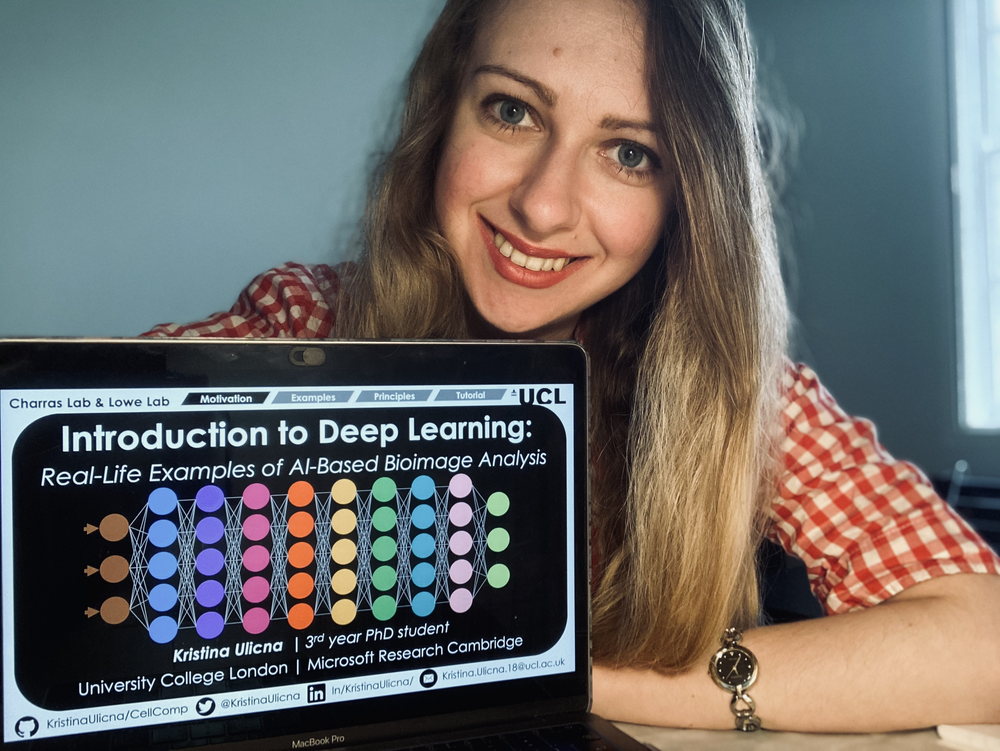
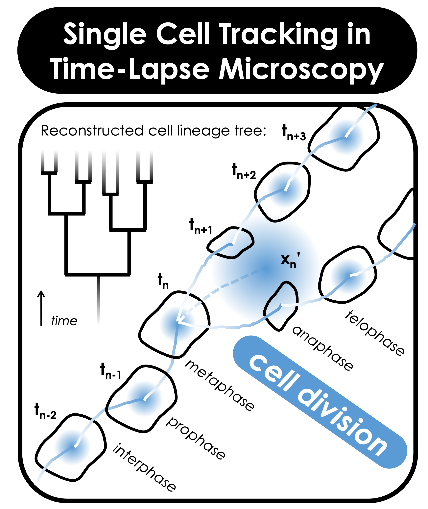
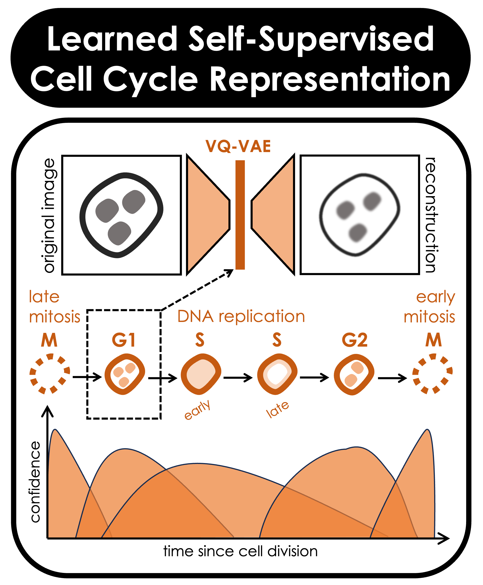
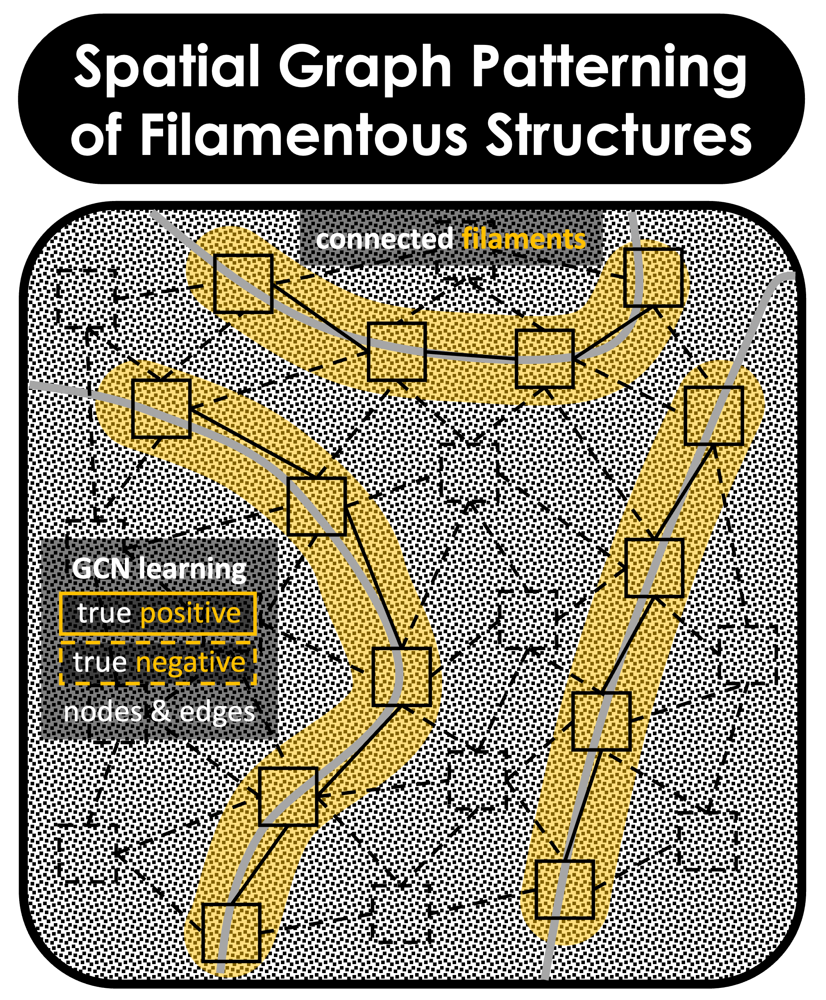
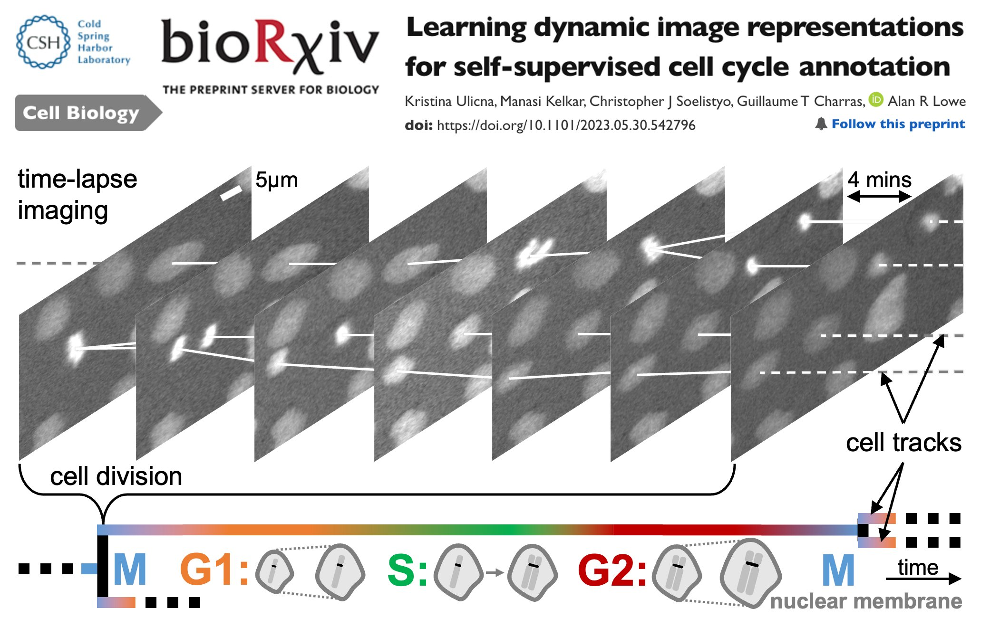

<!-- Your title -->

# Welcome to Kristina's GitHub Page! 👋

💡 Let's get straight to the point: [Check out my CV](CV_Kristina_Ulicna.pdf "Kristina's CV") 📄

My name is **_Kristina Ulicna, PhD_** & I'm a **_research associate_** at The [Alan Turing Institute](https://www.turing.ac.uk/people/research-associates/kristina-ulicna "Turing Research Associate Profile") 👩‍💻. I obtained my PhD degree from University College London (UCL) 🎓 as part of the [London Interdisciplinary Doctoral (LIDo) Bioscience Programme](https://www.lido-dtp.ac.uk/about-us "LIDo Doctoral Programme"), the largest BBSRC-funded Doctoral Training Partnership in the UK 🇬🇧. I'm a **_computational biologist_** focusing on the interplay between single-cell trajectories reconstruction 👣, representation 🔢 & interpretation 📊 via **_AI-driven bioimage analysis_** tool development 💻.

<!-- Your badges
You can use the website to generate badges: https://shields.io/
-->

<!-- Talking about you -->

## Me, a Computational Biologist

<!-- Any image aligned to the right. Beware the width -->
<!--img width="50%" align="right" alt="LIDo_Int" src="https://github.com/KristinaUlicna/KristinaUlicna/blob/master/LIDo_Interview.jpg" /-->

I'm a trained biomedical scientist turned computational biologist. After obtaining my BSc degree in Biomedical Science @ King's College London, I started my PhD training with the London Interdisciplinary Doctoral ([LIDo](https://www.lido-dtp.ac.uk/about-us "LIDo Doctoral Programme")) Programme @ University College London (UCL). I completed my PhD under the guidance of Drs Alan Lowe (The Alan Turing Institute 'AI for Science' Fellow, UCL) & Guillaume Charras (London Centre for Nanotechnology, UCL). 

_Note:_ If you are a non-scientist interested in what I do, before you get overwhelmed by the scientific jargon & terminology, check out my [#DeepTree🌳 Tweetorial Thread 🧵](https://twitter.com/KristinaUlicna/status/1305479359084539904 "DeepTree Thread on Twitter") for an easy-to-digest breakdown of my research for lay audience. In case you're not scared of the technical terms, don't hesitate to check out my papers in the [Citation section](#citations) find out how to properly cite our work, or read the brief description below:

The overall theme of my PhD thesis was **quantitative labelling of single-cell trajectories in time-lapse microscopy**. That said, the work could be easily split into two parts:
1. ***Trajectory reconstruction & lineaging***
    + Co-developed a robust, supervision-free, deep learning-based cell tracking pipeline for deep lineage analysis of live-cell microscopy 2D cell lines data
    + Analysed multi-generational lineage trees of >20k single-cell trajectories to interpret proliferation characteristics predisposing cells to fast divider rates
2. ***Track representation & interpretation***
    + Generated an explainable AI model to learn dynamic image representations & interpretable latent space features to map similarities of cell cycle continuity
    +  Transformed a sequence of image repre-sentations into an unsupervised trajectory annotation, classifying cell cycle phases & quantitative confidence scoring over time

---

## Me, a Research Scientist

<!-- Any image aligned to the right. Beware the width -->
<!--img width="30%" align="left" alt="bioRxiv" src="https://github.com/KristinaUlicna/KristinaUlicna/blob/master/bioRxiv_preprint.jpg" /-->

<!--img width="30%" align="left" alt="bioRxiv" src="./bioRxiv_preprint.jpg" /-->

#### Past Achievements

I'm a trained **cancer biologist** with a 1st class Biomedical Science degree from King's College London. I'm a practical & detail-oriented researcher with a unique combination of wet-lab & dry-lab skills which I gained through various [internship experience](CV_Kristina_Ulicna.pdf "Kristina's CV") in both **academia & industry**. To point out a few, I interned in the famous [Robert Weinberg's Lab](http://weinberglab.wi.mit.edu/ "Bob Weinberg Lab website") at **Massachusetts Institute of Technology (MIT)** in Cambridge, MA, USA where I worked on the identification of a novel tumour suppressor gene. Most recently, **Microsoft Research Cambridge** [Inner Eye group](https://www.microsoft.com/en-us/research/project/medical-image-analysis/ "Inner Eye Group Website") welcomed me to their team for 6-month PhD internship, which I spent contributing to the SOTA solutions of a (bio)medical image analysis-oriented Kaggle challenge in collaboration with the [Human Protein Atlas](https://www.kaggle.com/c/hpa-single-cell-image-classification/overview "Human Protein Atlas - Single Cell Classification") database founders.

#### Present Interests

Now as a PhD graduate, I'm interested in deep learning-based representation of **single-cell trajectories** in cell populations. I use a combination of _time-lapse microscopy movies_ to enhance my passion for _big data science, deep learning & computational cell tracking_ to understand morphological features influencing **single-cell cycling heterogeneity**. I'm actively developing AI-driven tools to answer my PhD thesis project goal - quantitatively follow and temporally label cell cycle trajectories from cell's early life to cell division. To do so, I combine feature handcrafting tools with **variational autoencoders (VAE)** approaches to encode the single-cell sequences throughout their lifetime for cell trajectory reconstruction. I'm clustering these data to find (dis-)similarities between the individual cells. Using **time-sequence analysis** methods, I shortlist the regions of the sequence data to identify patterns leading to pre-determination of cell cycle lifetimes.

#### Future Outlooks

I'm always in search for interesting **full-time Research Scientist / Computational Biologist positions** at the interface of Machine Learning & Biological / Biomedical Research. If my work sparked some interest in you, do not hesitate to get in touch! Don't forget to check [my up-to-date CV](CV_Kristina_Ulicna.pdf "Kristina's CV") for a better overview of my skillset, work / teaching experience & professional interests, or write me an [email](mailto:kristina.smith.ulicna@gmail.com) / message me directly using the social media links in the panel above. Always happy to hear from you!

---

## Me, a Science Communicator

I love talking about my research to a variety of audiences! Whether you're an expert with 20 years worth of research experience or a lay listener fascinated by biomedical science, you're at the right place... Let me list a few resources you may be interested in having a look at to learn more about my research interests: use this **traffic light system** to navigate the links based on your level of expertise:

- 🟩 : lay audience with interest to learn more
- 🟧 : scientist / technologist from outside of this field
- 🟥 : expert 'singlecellologist' who enjoys the niche jargon 🤓)

1. 🟢🟩🟢 In this [Twitter thread 🧵](https://twitter.com/KristinaUlicna/status/1305479359084539904 "#DeepTree on Twitter"), I introduced the objective of my PhD research project & how we tackled the single-cell heterogeneity in cell populations by developing super-cool live-cell microscopy & computational tools... 🧪

2. 🟢🟩🟢 I spoke about my research at the [PyLadies Meetup 👩‍💻](https://www.youtube.com/watch?v=UIY-Z7daEG0&t=977s&ab_channel=DublinPyLadies "PyLadies Dublin November 2020") where I delivered a talk about how Python (the programming language, not the snake 🐍!) can serve as an incredibly useful tools to (not only computational) biologists... 💻

3. 🟠🟧🟠 This short 12-second [LinkedIn movie 🎬](https://www.linkedin.com/posts/kristinaulicna_cellcyclecontrol-microscopy-images-activity-6685890976306745344-gNFo "LinkedIn Heterogeneity Movie") illustrates how much information 📊 regarding cell cycle control one may squeeze out from a sequence of microscopy images using machine (deep) learning... 🔬

4. 🟠🟧🟠 This visually-appealing [Twitter thread 🧵](https://twitter.com/KristinaUlicna/status/1283043766987890688 "'Intro to Deep Learning' Masterclass") summarises the key outcomes 🔑 of the "Introduction to Deep Learning" MasterClass (with [Youtube link](https://youtu.be/Cg1WKM2eWxs "'Introduction to Deep Learning' MasterClass | Kristina Ulicna") to the talk) which I recently delivered at the UCL Cancer Domain Early Career Network... 👩‍🏫

5. 🔴🟥🔴 I describe the scientific details of *my PhD thesis research project* in my [CellComp repository](https://github.com/KristinaUlicna/CellComp "CellComp repository") where I explain the background, objectives, methodology & key results of my doctoral thesis project... 👩‍🔬

6. 🔴🟥🔴 And last but not least, our recent publications to be found at [Frontiers](https://www.frontiersin.org/articles/10.3389/fcomp.2021.734559/full "Frontiers publication") journal website or at the [bioRxiv](https://www.biorxiv.org/content/10.1101/2020.09.10.276980v1.full "bioRxiv preprint") preprint repository should give you all the details you need to know about what we've done in the lab & beyond. ➡️ We also encourage you to jump to my [DeepTree repository](https://github.com/KristinaUlicna/DeepTree "DeepTree repository") if you'd like to learn even more... 🌳
---

### What keeps me busy? 👩‍💻 Live projects 🚧

+ 👩‍💻 Co-developing **g**raph **r**epresentation **a**nalysis for **c**onnected **e**mbeddings ([GRACE](https://github.com/alan-turing-institute/grace "Graph Representation Analysis for Connected Embeddings")) for automated object identification of structural patterns in (bio-)imaging datasets 
- 👯 I’m looking to collaborate on bioscience research ideas & projects involving AI;
- 💼 I'm in search of interesting technical roles & job openings to enhance my skills;
- 💬 Ask me about anything -> [I am happy to answer your questions](mailto:kristina.smith.ulicna@gmail.com) & help you out;
- 📫 How to reach me: check the banners on top / bottom of this page!

### Open-Source Projects 🚧

I've been contributing to a handful of open-source projects lately, mastering my **software engineering skills** & how to improve my programming practices. Check out the projects below or have a direct look at my [contributions](https://github.com/alan-turing-institute/grace/graphs/contributors) at some of the repositories I helped to build by visiting [my GitHub repositories link](https://github.com/KristinaUlicna?tab=repositories "Kristina's GitHub repositories") 🔗 for more details (links coming soon!).

|  |  |  |
| :----------------------------------: | :----------------------------------: | :----------------------------------: |

### Languages & Tools 🔧

<!-- Your github readme stats
You can use this api: https://github.com/kristinaulicna/github-readme-stats
-->

  

  <!-- Your languages and tools. Be careful with the alignment.
  You can use this sites to get logos: https://www.vectorlogo.zone or https://simpleicons.org/
  -->
  <code></code>
  <code></code>
  <code></code>

### Getting in Touch 💬

If you're interested in more details about:
+ **My professional background & research experience,** have a look at [my CV](CV_Kristina_Ulicna.pdf "Kristina's CV") 📄 or choose to click on the links below 👇

---
### Citations

More details about my recent publications focussed on single-cell tracking approach from time-lapse microscopy data can be found in my [*DeepTree repository*](https://github.com/KristinaUlicna/DeepTree "DeepTree repository") or in the following publications:

**Learning dynamic image representations for self-supervised cell cycle annotation**  
Ulicna K, Kelkar M, Soelistyo CJ, Charras GT & Lowe AR  
*ICML Computational Biology Workshop* (2023) 
Links: [Workshop](https://icml-compbio.github.io/2023/papers/WCBICML2023_paper23.pdf) | [bioRxiv](https://www.biorxiv.org/content/10.1101/2023.05.30.542796v1.full)

**_Perspective:_ Machine learning enhanced cell tracking**
Soelistyo, C.J., Ulicna, K. & Lowe, A.R. 
*Frontiers in Bioinformatics, Expert Opinions in Computational Bioimaging* (2023)
Links: [Frontiers](https://www.frontiersin.org/articles/10.3389/fbinf.2023.1228989/full)

**Convolutional neural networks for classifying chromatin morphology in live cell imaging**  
Ulicna K, Ho LTL, Soelistyo CJ, Day NJ & Lowe AR  
*Methods in Molecular Biology, Springer Nature Protocols* (2022)
Links: [Springer](https://link.springer.com/protocol/10.1007/978-1-0716-2221-6_3)

**Automated deep lineage tree analysis using a Bayesian single cell tracking approach**  
Ulicna K, Vallardi G, Charras G & Lowe AR  
*Frontiers in Computer Science, Computer Vision: Methods & Tools for Bioimage Analysis* (2021)  
Links: [Frontiers](https://www.frontiersin.org/articles/10.3389/fcomp.2021.734559/full) | [bioRxiv](https://www.biorxiv.org/content/10.1101/2020.09.10.276980v1.full)
